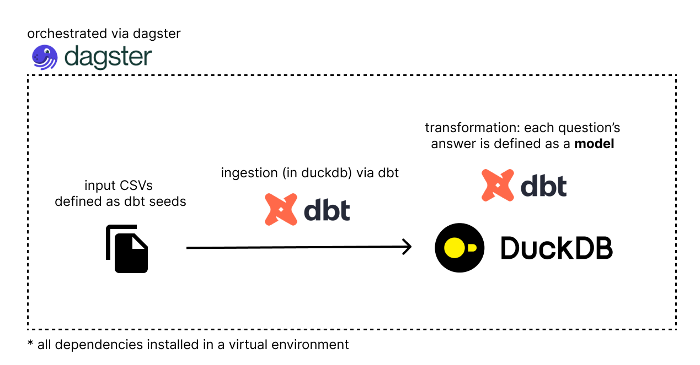

# SuperAwesome Home Assignment
author: [@octavianzarzu](https://www.linkedin.com/in/octavianz/)

This repository contains my submissions for the SuperAwesome Data Code Challenge.

# Table of Contents
1. [What is included](#what-is-included)
2. [How to run it](#how-to-run-it)
    1. [Dagster](#dagster)
    2. [dbt](#dbt)
3. [Reading a model](#reading-a-model)
4. [Querying tables live in DuckDB](#querying-tables-live)
5. [Answers](#answers)


## What is included?

The setup can be executed locally. It installs [DuckDB](https://duckdb.org/), [dbt-duckdb](https://github.com/duckdb/dbt-duckdb), and [Dagster](https://dagster.io/) by running `make all`. All SQL questions have been modeled as dbt models.

Here is a diagram illustrating the process:



## How to run it

At the root folder, there is a Makefile that creates a virtual environment (venv), installs the required dependencies, the DuckDB CLI, copies input CSVs as dbt seeds, and starts Dagster.

To run it, open a terminal and execute:

```
make all
```

This will install the dependencies, copy the input CSVs as dbt seeds, and start the Dagster web server.

Optionally, to install DuckDB CLI on Mac (via brew), run:

```
make install_duckdb
```

For installation on other platforms, such as Windows, check the official [DuckdDB Installation page](https://duckdb.org/docs/installation/?version=stable&environment=cli&platform=win&download_method=package_manager&architecture=x86_64).

To remove the virtual environment and logs, run:

```
make clean
```

### Dagster

Once `make all` command finishes, you can access Dagster in your browser at [localhost:3000](http://localhost:3000/). Dagster reads the dbt project from the `transform/` folder.


You can build the assets by clicking on the Materialize button.

### dbt 

dbt uses DuckDB to perform SQL transformations (configured in `transform/profiles.yml`) and stores the results (schema and data) in a single file called `superawesome.duckdb` (also configured in `transform/profiles.yml`).

> [!WARNING]
> The superawesome.duckdb database file is included in .gitignore and not tracked by Git due to its size (>100MB).

Once the first model is materialized, the superawesome.duckdb database file is created.

Each question is modeled as a dbt model. Some base models were created for reusability, as several questions share similar SQL snippets. All models reside in [transform/models/](./transform/models/) folder.

## Reading a model

In each model, you’ll find the query that populates the table. Some models reference other base models using the `{{ ref('') }}` function. The output has been added as a comment to the query, along with the full query (without references).

The structure of a SQL model is as follows:

1.	Explanation of the approach
2.	The dbt query using one or more reference models
3.	The output result set (which can also be viewed live in duckdb once all assets are materialized via Dagster)

Order in which to read: 

```md
transform/models
└── staging
    ├── 1. clean_comic_characters_info.sql - Cleans `comic_characters_info`. Used in Questions a, b, c, d, f
    ├── 2. union_dc_marvel_data.sql - Unions `dc-data` and `marvel-data`. Used in Questions a, b, c, d, e, f
    └── 3. superpowers_character.sql - Fetches only the name of a character and their superpower. Used in Questions e, g, h
├── 4. a_top_10_villains_by_appearance_per_publisher.sql
├── 5. b_top_10_heroes_by_appearance_per_publisher.sql
├── 6. c_bottom_10_villains_by_appearance_per_publisher.sql
├── 7. d_bottom_10_heroes_by_appearance_per_publisher.sql
├── 8. e_top_10_most_common_superpowers.sql
├── 9. f_top_10_heroes.sql
├── 10. g_five_most_common_superpowers.sql
├── 11. h_villain_hero_having_the_five_most_common_superpowers.sql
```


### Querying tables live 

If DuckDB CLI was installed (`make install_duckdb`), activate the virtual environment in the root folder and open the `superawesome.duckdb` file in DuckDB:

```
source venv/bin/activate
duckdb superawesome.duckdb
```

You can query individual models, like:

```
show tables;
```

|                           name                           |
|----------------------------------------------------------|
| a_top_10_villains_by_appearance_per_publisher             |
| b_top_10_heroes_by_appearance_per_publisher               |
| c_bottom_10_villains_by_appearance_per_publisher          |
| clean_comic_characters_info                               |
| comic_characters_info                                     |
| d_bottom_10_heroes_by_appearance_per_publisher            |
| dc-data                                                   |
| e_top_10_most_common_superpowers                          |
| f_top_10_heroes                                           |
| g_five_most_common_superpowers                            |
| h_villain_hero_having_the_five_most_common_superpowers    |
| hero-abilities                                            |
| marvel-data                                               |
| superpowers_character                                     |
| union_dc_marvel_data                                      |
|                           15 rows                        |

```
select * from a_top_10_villains_by_appearance_per_publisher;
```

Alternatively, you can use [Motherduck](https://motherduck.com/), a managed DuckDB service. After creating a free account, you can connect to the local DuckDB file:

```
ATTACH 'md:';
```

Then create or replace the remote database as a clone of the local one:

```
CREATE OR REPLACE DATABASE superawesome_s FROM CURRENT_DATABASE();
```


## Answers

<details><summary>Base models (clean_comic_characters_info, union_dc_marvel_data, superpowers_character) </summary>

### model: [clean_comic_characters_info](./transform/models/staging/clean_comic_characters_info.sql)

1.  The `Alignment` column (good, bad, neutral, and 7 NA values) identifies a character as either a villain (bad) or a hero (good).
2.  There is only one character that is identified as both a villain (bad) and a hero (good):
    
    ```sql
    SELECT name
    FROM comic_characters_info
    GROUP BY name
    HAVING count(distinct alignment) > 1;
    ```
    
    | Name  |
    |-------|
    | Atlas |
    
    However, this character is labeled differently by different publishers:
    
    | Name  | Alignment | Publisher         |
    |-------|-----------|-------------------|
    | Atlas | good      | Marvel Comics     |
    | Atlas | bad       | DC Comics         |
    
    Most questions focus on publisher-specific answers, so this doesn’t pose an issue.

3.  There are duplicate character names, and some characters appear across multiple publishers (e.g., `Atlas` above). Since no question requires attributes from `comic_characters_info` beyond name, alignment, and publisher, we can safely ‘drop’ the remaining features and select only one entry per character, publisher, and alignment.

    ```sql
    SELECT 
        name, 
        alignment, 
        publisher
    FROM comic_characters_info
    QUALIFY row_number() OVER (PARTITION BY name, alignment, publisher) = 1
    ORDER BY name;
    ```

    **718 rows (734 without filtering)**

    Some characters lack publisher information, but this does not affect our analysis.
    
    This subset will act as the base for further analysis.


    ```sql clean_comic_characters_info
    SELECT 
        name, 
        alignment, 
        publisher
    FROM {{ ref('comic_characters_info') }} 
    QUALIFY row_number() OVER (PARTITION BY name, alignment, publisher) = 1
    ORDER BY name
    ```

### model: [union_dc_marvel_data](./transform/models/staging/union_dc_marvel_data.sql)
    
**dc-data table**

1. The name represents a concatenation of the character name and the universe/comic name (in parentheses). We can extract only the first part (before the parentheses) using `split_part`, but there may be cases where the character name contains parentheses as well. Let’s look at those cases:

    ```sql
    SELECT split_part(name, '(', 1) as character_name 
    FROM "dc-data"
    GROUP BY ALL 
    HAVING count(*) > 1;
    ```

    **17 rows returned, of which:**
    
    - 12 have the same alive status (either deceased or alive in both comics they appear in)
    - 5 have a different status (deceased in one comic, alive in another)

    The only noticeable entry is `Krypto`

    ```sql
    SELECT split_part(name, '(', 1) as character_name, name, alive, appearances 
    FROM "dc-data"
    WHERE name like 'Krypto %';
    ```

    | character_name       | name                             | alive              | appearances |
    |----------------------|----------------------------------|--------------------|-------------|
    | Krypto 	           | Krypto (New Earth)	              | Living Characters  | 109         |
    | Krypto the Earth Dog | Krypto the Earth Dog (New Earth) | Living Characters  | 24          |
    | Krypto 	           | Krypto (Clone) (New Earth)       |	Deceased Characters| 1           |

    Even though it’s a clone/duplicate entry, the status is different, so the additional appearance will count toward the total.

    ```sql
    SELECT split_part(name, '(', 1) as character_name, 
       sum(appearances) 
    FROM "marvel-data"
    GROUP BY character_name
    ```

**marvel-data table** 

1. The same analysis can be done as for the `dc-data` file.

2. Character names are lowercase in `marvel-data`, while in `dc-data` and `comic_characters_info` they are capitalized.


    ```sql union_dc_marvel_data
    WITH 
    clean_dc_data AS 
    (
        SELECT 
            split_part(name, ' (', 1) as character_name, 
            sum(appearances) as appearances
        FROM {{ ref('dc-data') }} 
        GROUP BY character_name
    ),
    clean_marvel_data AS 
    (
        SELECT 
            split_part(name, ' (', 1) as character_name, 
            sum(appearances) as appearances
        FROM {{ ref('marvel-data') }} 
        GROUP BY character_name
    )
    SELECT 'DC Comics' as publisher, character_name, appearances
    FROM clean_dc_data
    UNION 
    SELECT 'Marvel Comics' as publisher, character_name, appearances
    FROM clean_marvel_data
    ```

### model: [superpowers_character](./transform/models/staging/superpowers_character.sql)

1. Cleans up the character name.
    
    ```sql
    SELECT 
        split_part(name, ' (', 1) as name, 
        superpowers
    FROM {{ ref('hero-abilities') }}
    ```

</details>

<details><summary>Top 10 villains by appearance per publisher 'DC', 'Marvel' and 'other'</summary>

### model: [a_top_10_villains_by_appearance_per_publisher](./transform/models/a_top_10_villains_by_appearance_per_publisher.sql)

1. Starting from the [clean_comic_characters_info](./transform/models/staging/clean_comic_characters_info.sql) model, and joining with the appearance data from the [dc-data and marvel-data union](./transform/models/staging/union_dc_marvel_data.sql).

2. Filter only the top 10 villains by appearances per publisher using the `QUALIFY` clause.

    ```sql
    SELECT 
        ccci.name,
        ccci.publisher,
        dmd.appearances
    FROM {{ ref('clean_comic_characters_info') }} ccci
        INNER JOIN {{ ref('union_dc_marvel_data') }} dmd ON lower(ccci.name) = lower(dmd.character_name) AND ccci.publisher = dmd.publisher
    WHERE ccci.alignment = 'bad'
    QUALIFY ROW_NUMBER() OVER (partition by ccci.publisher order by dmd.appearances desc) <= 10
    ORDER BY publisher asc, appearances desc
    ```

    | Name              | Publisher      | Appearances |
    |-------------------|----------------|-------------|
    | Joker             | DC Comics      | 517         |
    | Swamp Thing       | DC Comics      | 309         |
    | Big Barda         | DC Comics      | 216         |
    | Gorilla Grodd     | DC Comics      | 179         |
    | Bane              | DC Comics      | 157         |
    | Maxima            | DC Comics      | 124         |
    | Granny Goodness   | DC Comics      | 115         |
    | Black Manta       | DC Comics      | 95          |
    | Amazo             | DC Comics      | 71          |
    | Mister Mxyzptlk   | DC Comics      | 64          |
    | Sabretooth        | Marvel Comics  | 382         |
    | Venom             | Marvel Comics  | 371         |
    | Mephisto          | Marvel Comics  | 317         |
    | Thanos            | Marvel Comics  | 317         |
    | Bullseye          | Marvel Comics  | 277         |
    | Mandarin          | Marvel Comics  | 193         |
    | Ultron            | Marvel Comics  | 187         |
    | Sebastian Shaw    | Marvel Comics  | 174         |
    | Hela              | Marvel Comics  | 170         |
    | Dormammu          | Marvel Comics  | 132         |

    > Note: Many rows are filtered out when joining with `clean_comics_character_info` (this can be observed by changing from an INNER JOIN to a FULL OUTER JOIN). While one might perform the analysis based on dc-data and marvel-data only, we cannot determine if a character is good or bad without performing this join.

    Extended query without dbt ref's:

    ```sql 

    WITH clean_comics_character_info AS 
    (
        SELECT 
            name, 
            alignment, 
            publisher,
        FROM comic_characters_info
        QUALIFY row_number() OVER (PARTITION BY name, alignment, publisher) = 1
        ORDER BY name
    ),
    clean_dc_data AS 
    (
        SELECT 
            split_part(name, ' (', 1) as character_name, 
            sum(appearances) as appearances
        FROM "dc-data"
        GROUP BY character_name
    ),
    clean_marvel_data AS 
    (
        SELECT 
            split_part(name, ' (', 1) as character_name, 
            sum(appearances) as appearances
        FROM "marvel-data"
        GROUP BY character_name
    ),
    dc_marvel_data AS 
    (
        SELECT 'DC Comics' as publisher, character_name, appearances
        FROM clean_dc_data
        UNION 
        SELECT 'Marvel Comics' as publisher, character_name, appearances
        FROM clean_marvel_data
    )
    SELECT 
        ccci.name,
        ccci.publisher,
        dmd.appearances
    FROM clean_comics_character_info ccci
        INNER JOIN dc_marvel_data dmd ON lower(ccci.name) = lower(dmd.character_name) AND ccci.publisher = dmd.publisher
    WHERE ccci.alignment = 'bad'
    QUALIFY ROW_NUMBER() OVER (partition by ccci.publisher order by dmd.appearances desc) <= 10
    ORDER BY publisher asc, appearances desc
    ```

</details>


<details><summary>Top 10 heroes by appearance per publisher 'DC', 'Marvel' and 'other'</summary>

### model: [b_top_10_heroes_by_appearance_per_publisher.sql](./transform/models/b_top_10_heroes_by_appearance_per_publisher.sql)

1. Same as above, only replacing the alignment condition to be equal to `Good`.

    ```sql
    SELECT 
        ccci.name,
        ccci.publisher,
        dmd.appearances
    FROM {{ ref('clean_comic_characters_info') }} ccci
        INNER JOIN {{ ref('union_dc_marvel_data') }} dmd ON lower(ccci.name) = lower(dmd.character_name) AND ccci.publisher = dmd.publisher
    WHERE ccci.alignment = 'good'
    QUALIFY ROW_NUMBER() OVER (partition by ccci.publisher order by dmd.appearances desc) <= 10
    ORDER BY publisher asc, appearances desc
    ```

    | Name              | Publisher      | Appearances |
    |-------------------|----------------|-------------|
    | Batman            | DC Comics      | 3093        |
    | Superman          | DC Comics      | 2496        |
    | Wonder Woman      | DC Comics      | 1231        |
    | Aquaman           | DC Comics      | 1121        |
    | Flash             | DC Comics      | 1028        |
    | Alan Scott        | DC Comics      | 969         |
    | Alfred Pennyworth | DC Comics      | 930         |
    | Kyle Rayner       | DC Comics      | 716         |
    | Guy Gardner       | DC Comics      | 593         |
    | John Stewart      | DC Comics      | 549         |
    | Spider-Man        | Marvel Comics  | 4043        |
    | Captain America   | Marvel Comics  | 3362        |
    | Wolverine         | Marvel Comics  | 3062        |
    | Iron Man          | Marvel Comics  | 2966        |
    | Thor              | Marvel Comics  | 2259        |
    | Hulk              | Marvel Comics  | 2019        |
    | Vision            | Marvel Comics  | 1137        |
    | Jean Grey         | Marvel Comics  | 1115        |
    | Emma Frost        | Marvel Comics  | 886         |
    | Luke Cage         | Marvel Comics  | 862         |

</details>


<details><summary>Bottom 10 villains by appearance per publisher 'DC', 'Marvel' and 'other'</summary>

### model: [c_bottom_10_villains_by_appearance_per_publisher.sql](./transform/models/c_bottom_10_villains_by_appearance_per_publisher.sql)

1. Same query as in Question 1, but changing the ordering in the QUALIFY clause from 
`dmd.appearances DESC` to `dmd.appearances ASC`, and updating the ORDER BY in the outer query for readability.

    ```sql
    SELECT 
        ccci.name,
        ccci.publisher,
        dmd.appearances
    FROM {{ ref('clean_comic_characters_info') }} ccci
        INNER JOIN {{ ref('union_dc_marvel_data') }} dmd ON lower(ccci.name) = lower(dmd.character_name) AND ccci.publisher = dmd.publisher
    WHERE ccci.alignment = 'bad'
    QUALIFY ROW_NUMBER() OVER (partition by ccci.publisher order by dmd.appearances asc) <= 10
    ORDER BY publisher asc, appearances asc
    ```

    | Name              | Publisher      | Appearances |
    |-------------------|----------------|-------------|
    | White Canary      | DC Comics      | 6           |
    | Siren             | DC Comics      | 8           |
    | Faora             | DC Comics      | 15          |
    | Parademon         | DC Comics      | 15          |
    | Atlas             | DC Comics      | 16          |
    | Steppenwolf       | DC Comics      | 23          |
    | Trigon            | DC Comics      | 58          |
    | Mister Mxyzptlk   | DC Comics      | 64          |
    | Amazo             | DC Comics      | 71          |
    | Black Manta       | DC Comics      | 95          |
    | Bird-Man          | Marvel Comics  | 1           |
    | Tiger Shark       | Marvel Comics  | 1           |
    | Abomination       | Marvel Comics  | 1           |
    | Hydro-Man         | Marvel Comics  | 1           |
    | Yellow Claw       | Marvel Comics  | 1           |
    | Black Mamba       | Marvel Comics  | 1           |
    | Apocalypse        | Marvel Comics  | 2           |
    | Red Skull         | Marvel Comics  | 2           |
    | Vulture           | Marvel Comics  | 2           |
    | Snake-Eyes        | Marvel Comics  | 3           |

</details>

<details><summary> Bottom 10 heroes by appearance per publisher 'DC', 'Marvel' and 'other'</summary>

### model: [d_bottom_10_heroes_by_appearance_per_publisher.sql](./transform/models/d_bottom_10_heroes_by_appearance_per_publisher.sql)

1. Same query as in Question 2, but changing the ordering in the QUALIFY clause from 
`dmd.appearances DESC` to `dmd.appearances ASC`, and updating the ORDER BY in the outer query for readability.

    ```sql
    SELECT 
        ccci.name,
        ccci.publisher,
        dmd.appearances
    FROM {{ ref('clean_comic_characters_info') }} ccci
        INNER JOIN {{ ref('union_dc_marvel_data') }} dmd ON lower(ccci.name) = lower(dmd.character_name) AND ccci.publisher = dmd.publisher
    WHERE ccci.alignment = 'good'
    QUALIFY ROW_NUMBER() OVER (partition by ccci.publisher order by dmd.appearances asc) <= 10
    ORDER BY publisher asc, appearances asc

    ```

    | Name         | Publisher     | Appearances |
    |--------------|---------------|-------------|
    | Arsenal      | DC Comics     | 1           |
    | Impulse      | DC Comics     | 1           |
    | Green Arrow  | DC Comics     | 1           |
    | Huntress     | DC Comics     | 1           |
    | Oracle       | DC Comics     | 3           |
    | Misfit       | DC Comics     | 3           |
    | Enchantress  | DC Comics     | 5           |
    | Osiris       | DC Comics     | 8           |
    | Starfire     | DC Comics     | 15          |
    | Azrael       | DC Comics     | 37          |
    | Thing        | Marvel Comics | 1           |
    | Boomer       | Marvel Comics | 1           |
    | Corsair      | Marvel Comics | 1           |
    | Phoenix      | Marvel Comics | 1           |
    | Dagger       | Marvel Comics | 1           |
    | Valkyrie     | Marvel Comics | 1           |
    | Man-Thing    | Marvel Comics | 1           |
    | Goliath      | Marvel Comics | 1           |
    | Morph        | Marvel Comics | 1           |
    | Vulcan       | Marvel Comics | 1           |

</details>

<details><summary> Top 10 most common superpowers by creator 'DC', 'Marvel' and 'other'</summary>

### model: [e_top_10_most_common_superpowers.sql](./transform/models/e_top_10_most_common_superpowers.sql)

1. Join superpowers with clean_dc_marvel_data (similar to Questions 1, 2, 3, and 4).

    ```sql
    WITH superpowers AS 
    (
    SELECT 
            name,
            superpowers
    FROM {{ ref('superpowers_character') }}
    ),
    dc_marvel_data AS 
    (
        SELECT 
            publisher, 
            character_name
        FROM {{ ref("union_dc_marvel_data")}}
    ),
    publisher_superpowers_join AS
    (
        SELECT 
            sp.name,
            dmd.publisher,
            sp.superpowers
        FROM superpowers sp
            INNER JOIN dc_marvel_data dmd ON lower(sp.name) = lower(dmd.character_name)
    ),
    ..
    ```

2. Convert the `superpowers` column into an array and using UNNEST so each superpower from the array appears on a separate row for each publisher.

    ```sql 
    ,
    publisher_superpowers_join_unnest AS 
    (
    SELECT 
        UNNEST(CAST(superpowers AS VARCHAR[])) as superpower, 
        publisher
    FROM publisher_superpowers_join
    )
    ...
    ```

3. Count how many times each superpower is mentioned per publisher and apply the same QUALIFY clause as in Questions 1-4 to only output the top 10 per publisher.

    ```sql 
    SELECT 
        replace(superpower,'''','') as superpower,
        publisher,
        count(*) as count  
    FROM publisher_superpowers_join_unnest
    GROUP BY superpower, publisher
    QUALIFY ROW_NUMBER() OVER (partition by publisher order by count(*) desc) <= 10
    ORDER BY publisher, count(*) DESC
    ```

    **Final query**:

    ```sql 
    WITH superpowers AS 
    (
    SELECT 
            name,
            superpowers
    FROM {{ ref('superpowers_character') }}
    ),
    dc_marvel_data AS 
    (
        SELECT 
            publisher, 
            character_name
        FROM {{ ref("union_dc_marvel_data")}}
    ),
    publisher_superpowers_join AS
    (
        SELECT 
            sp.name,
            dmd.publisher,
            sp.superpowers
        FROM superpowers sp
            INNER JOIN dc_marvel_data dmd ON lower(sp.name) = lower(dmd.character_name)
    ),
    publisher_superpowers_join_unnest AS 
    (
    SELECT 
        UNNEST(CAST(superpowers AS VARCHAR[])) as superpower, 
        publisher
    FROM publisher_superpowers_join
    )
    SELECT 
        replace(superpower,'''','') as superpower,
        publisher,
        count(*) as count  
    FROM publisher_superpowers_join_unnest
    GROUP BY superpower, publisher
    QUALIFY ROW_NUMBER() OVER (partition by publisher order by count(*) desc) <= 10
    ORDER BY publisher, count(*) DESC
    ```

    | Name                | Publisher      | Appearances |
    |---------------------|----------------|-------------|
    | Agility             | DC Comics      | 79          |
    | Stamina             | DC Comics      | 74          |
    | Super Strength      | DC Comics      | 72          |
    | Durability          | DC Comics      | 68          |
    | Weapons Master      | DC Comics      | 67          |
    | Intelligence        | DC Comics      | 66          |
    | Reflexes            | DC Comics      | 66          |
    | Super Speed         | DC Comics      | 53          |
    | Weapon-based Powers | DC Comics      | 51          |
    | Marksmanship        | DC Comics      | 50          |
    | Agility             | Marvel Comics  | 134         |
    | Super Strength      | Marvel Comics  | 129         |
    | Durability          | Marvel Comics  | 128         |
    | Stamina             | Marvel Comics  | 118         |
    | Super Speed         | Marvel Comics  | 96          |
    | Reflexes            | Marvel Comics  | 92          |
    | Weapons Master      | Marvel Comics  | 90          |
    | Intelligence        | Marvel Comics  | 87          |
    | Accelerated Healing | Marvel Comics  | 82          |
    | Marksmanship        | Marvel Comics  | 75          |

</details>

<details><summary> Of the top 10 villains and heroes, re-rank them based on their overall score</summary>

### model: [f_top_10_heroes.sql](./transform/models/f_top_10_heroes.sql)

1. Let’s start with the result from Questions 1 and 2 and remove the `alignment = 'good'` condition to retrieve both villains and heroes.

    ```sql
    WITH top_10_villains_and_heroes AS 
    (
        SELECT 
            ccci.name,
            ccci.publisher,
            dmd.appearances
        FROM {{ ref('clean_comic_characters_info') }} ccci
            INNER JOIN {{ ref('union_dc_marvel_data') }} dmd ON lower(ccci.name) = lower(dmd.character_name) AND ccci.publisher = dmd.publisher
        QUALIFY ROW_NUMBER() OVER (partition by '' order by dmd.appearances desc) <= 10
        ORDER BY appearances desc
    ),
    ```

2. Now, let’s join the `hero-abilities` table to get the `overall_score`. As we can see, there are duplicate entries for character names since a character may appear in multiple comics. We will calculate the average `overall_score` for each character. 

    > But, we encounter an error! Strings `∞` and `-` are part of the data. Let's use a CASE statement to replace these values: ∞ as 10000 (max value in the dataset is less than 1000) and - as 0. 

    ```sql
    SELECT 
        split_part(name, ' (', 1) as name, 
        AVG(CASE WHEN overall_score = '∞' THEN 10000 WHEN overall_score = '-' THEN 0 ELSE overall_score::INTEGER END) as overall_score
    FROM "hero-abilities"
    GROUP BY ALL;
    ``` 

3. Let's join the two datasets and order by the `overall_score`:

    ```sql
    WITH top_10_villains_and_heroes AS 
    (
        SELECT 
            ccci.name,
            ccci.publisher,
            dmd.appearances
        FROM {{ ref('clean_comic_characters_info') }} ccci
            INNER JOIN {{ ref('union_dc_marvel_data') }} dmd ON lower(ccci.name) = lower(dmd.character_name) AND ccci.publisher = dmd.publisher
        QUALIFY ROW_NUMBER() OVER (partition by '' order by dmd.appearances desc) <= 10
        ORDER BY appearances desc
    ),
    overall_score_by_character AS 
    (
    SELECT 
        split_part(name, ' (', 1) as name, 
        AVG(CASE WHEN overall_score = '∞' THEN 10000 WHEN overall_score = '-' THEN 0 ELSE overall_score::INTEGER END) as overall_score
    FROM {{ ref('hero-abilities')}}
    GROUP BY ALL
    )
    SELECT 
    t10.name,
    t10.publisher,
    t10.appearances,
    osc.overall_score
    FROM top_10_villains_and_heroes t10 
    LEFT JOIN overall_score_by_character osc ON t10.name = osc.name
    ORDER BY overall_score DESC
    ```

    | Name            | Publisher      | Appearances | Overall_score        |
    |-----------------|----------------|-------------|----------------------|
    | Hulk            | Marvel Comics  | 2019        | 32                   |
    | Iron Man        | Marvel Comics  | 2966        | 22.8                 |
    | Wonder Woman    | DC Comics      | 1231        | 19.66666666666668    |
    | Superman        | DC Comics      | 2496        | 17                   |
    | Vision          | Marvel Comics  | 1137        | 13                   |
    | Captain America | Marvel Comics  | 3362        | 9.66666666666666     |
    | Wolverine       | Marvel Comics  | 3062        | 8.5                  |
    | Batman          | DC Comics      | 3093        | 8                    |
    | Spider-Man      | Marvel Comics  | 4043        | 7.66666666666667     |
    | Thor            | Marvel Comics  | 2259        |                      |


    > We have used a `LEFT JOIN` given tha hero-abilities dataset doesn't contain an entry for Thor (only Thor Girl).

</details>


<details><summary> What are the 5 most common superpowers?</summary>

### model: [g_five_most_common_superpowers.sql](./transform/models/g_five_most_common_superpowers.sql)

1. We’ll use the first part of the answer from Question 5 and remove the join with the publisher.

    ```sql
    WITH superpowers AS 
    (
    SELECT 
            name,
            superpowers
    FROM {{ ref('superpowers_character') }}
    ),
    superpowers_unnest AS
    (
    SELECT 
        name,
        UNNEST(CAST(superpowers AS VARCHAR[])) as superpower
    FROM superpowers
    )
    SELECT 
        replace(superpower,'''','') as superpower,
        count(*) as count  
    FROM superpowers_unnest
    GROUP BY superpower
    QUALIFY ROW_NUMBER() OVER (partition by '' order by count(*) desc) <= 5
    ORDER BY count(*) DESC
    ```

    | Superpower      | Count |
    |-----------------|-------|
    | Agility         | 625   |
    | Stamina         | 587   |
    | Super Strength  | 582   |
    | Durability      | 557   |
    | Reflexes        | 483   |

</details>


<details><summary> Which hero and villain have the 5 most common superpowers?</summary>

### model: [h_villain_hero_having_the_five_most_common_superpowers.sql](./transform/models/h_villain_hero_having_the_five_most_common_superpowers.sql)

1. We’ll use the answer from Question 7 and join it back with `hero-abilities` to perform array searching via an INNER JOIN. Lastly, we will filter for characters who have all five of the most common superpowers.

    ```sql
    WITH superpowers AS 
    (
    SELECT 
            name,
            superpowers
    FROM {{ ref('superpowers_character') }}
    ),
    superpowers_unnest AS
    (
    SELECT 
        name,
        UNNEST(CAST(superpowers AS VARCHAR[])) as superpower
    FROM superpowers
    ), top_5_superpowers AS 
    (
    SELECT
        superpower,
        count
    FROM {{ ref("g_five_most_common_superpowers")}}
    )
    SELECT su.name
    FROM superpowers_unnest su 
    INNER JOIN top_5_superpowers t5s ON replace(su.superpower,'''','') = t5s.superpower
    GROUP BY su.name
    HAVING COUNT(*) = 5
    ```

    **199 rows returned.**

    | Name                    |
    |--------------------------|
    | A-Bomb                   |
    | Asura                    |
    | Commander Machia         |
    | Darth Nox                |
    | Devilman                 |
    | Fangtom                  |
    | Goku                     |
    | Hancock                  |
    | Harry Osborn             |
    | Hourman                  |
    | Kenshiro                 |
    | Killow                   |
    | Kisame                   |
    | Kruncha                  |
    | Lady Deadpool            |
    | Laira                    |
    | Life Entity              |
    | Namor                    |
    | Resurrection Spawn       |
    | Skales                   |
    | Spider-Gwen              |
    | The Executioner          |
    | The Great Devourer       |
    | Ultron                   |
    | Volstagg                 |
    | Angela                   |
    | Azrael                   |
    | Brainiac 5               |
    | Captain Britain          |
    | Damien Darhk             |
    | Garmadon                 |
    | Graviton                 |
    | Hogun                    |
    | Hybrid                   |
    | Invincible               |
    | Killian                  |
    | Kylo Ren                 |
    | Lucifer                  |
    | Mario                    |
    | Nadakhan                 |
    | Old King Thor            |
    | Puck                     |
    | Reign                    |
    | Shadow The Hedgehog      |
    | Skaar                    |
    | Stargirl                 |
    | The Keeper               |
    | The One Below All        |
    | Zane                     |
    | Attuma                   |
    | Bloodaxe                 |
    | Buri                     |
    | Chop'rai                 |
    | Cyborg Superman          |
    | Dante                    |
    | Dark Phoenix             |
    | Doctor Occult            |
    | Ghost Rider 2099         |
    | Grid                     |
    | Icon                     |
    | Infernal Hulk            |
    | Killmonger               |
    | Legolas                  |
    | Nagato Uzumaki           |
    | Nightcrawler             |
    | Nomad                    |
    | Samukai                  |
    | Samurai Mech (Stone Army) |
    | The Goon                 |
    | Venompool                |
    | Wesker                   |
    | World Breaker Hulk       |
    | Big Barda                |
    | Black Bolt               |
    | Caesar                   |
    | Captain Soto             |
    | Commander Blunck         |
    | Cull Obsidian            |
    | Death Seed Draken        |
    | Doom Slayer              |
    | Firestorm II             |
    | First Spinjitzu Master   |
    | General Cryptor          |
    | Grand Master Skywalker   |
    | Immortal Hulk            |
    | Iron Baron               |
    | Mongul                   |
    | Ragman                   |
    | Samurai X                |
    | Sasuke Uchiha            |
    | Scorpion                 |
    | Strange Visitor Superman |
    | The Crow                 |
    | The Upgrade              |
    | Toad                     |
    | Tobirama Senju           |
    | Ursa Major               |
    | Violator                 |
    | Warpath                  |
    | Abe Sapien               |
    | Acidicus                 |
    | Big Boss                 |
    | Catwoman                 |
    | Darth Maul               |
    | Fëanor                   |
    | Golden Ninja             |
    | Gorilla Grodd            |
    | Incredible Hulk          |
    | Lightray                 |
    | Mongul The Elder         |
    | Mystique                 |
    | Namorita                 |
    | Omega                    |
    | Powerboy                 |
    | Queen Hippolyta          |
    | Shisui Uchiha            |
    | Silk                     |
    | Solid Snake              |
    | Steel Serpent            |
    | The Rival                |
    | Vixen                   |
    | White Wolf               |
    | Wonder Girl              |
    | Zero                     |
    | Achilles Warkiller       |
    | Amazo                    |
    | Anti-Spawn               |
    | Bumblebee                |
    | Firestorm                |
    | Giant Stone Warrior      |
    | Heart Of The Monster Hulk|
    | Honey Badger             |
    | John Constantine         |
    | Kratos                   |
    | Lashina                  |
    | Madara Uchiha            |
    | Mistake                  |
    | Morlun                   |
    | Percy Jackson            |
    | Proxima Midnight         |
    | Raiden                   |
    | Selene                   |
    | Spider-Woman             |
    | Symbiote Wolverine       |
    | Thanos                   |
    | Vixen II                 |
    | Yang                     |
    | Zoom                     |
    | Angel Of Death           |
    | Annihilus                |
    | Battlestar               |
    | Bizarro-Girl             |
    | Bor Burison              |
    | Caliban                  |
    | Captain Mar-vell         |
    | Destroyer                |
    | Doomguy                  |
    | General Kozu             |
    | Granny Goodness          |
    | Green Lantern            |
    | Hellboy                  |
    | Hive                     |
    | Homelander               |
    | Karlof                   |
    | Lar Gand                 |
    | Martian Manhunter        |
    | Sonic The Hedgehog       |
    | Vampire Batman           |
    | Vergil                   |
    | Vili                     |
    | Alita                    |
    | Anacondrai Serpent       |
    | Aquaman                  |
    | Aspheera                 |
    | Balder                   |
    | Buffy                    |
    | Cheetah III              |
    | Corvus Glaive            |
    | Cosmic Hulk              |
    | Donna Troy               |
    | Dracula                  |
    | Gaara                    |
    | Gamora                   |
    | Goblin Force             |
    | Iron Destroyer           |
    | Kapau'rai                |
    | Lady Deathstrike         |
    | Lizard                   |
    | Lord Garmadon            |
    | Naruto Uzumaki           |
    | Omni-Man                 |
    | Reverse Flash            |
    | Scarlet Spider II        |
    | Shao Kahn                |
    | Shin Godzilla            |
    | Songbird                 |
    | Supergirl                |
    | T-X                      |
    | The Beyonder             |

</details>
